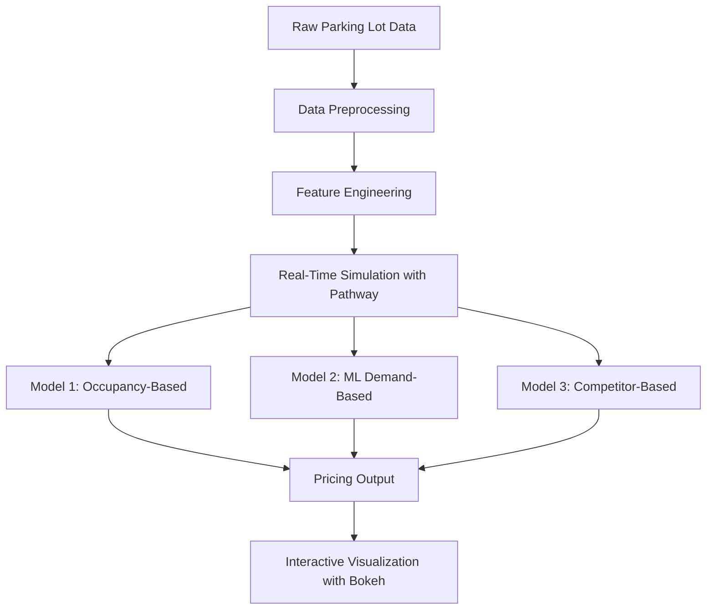
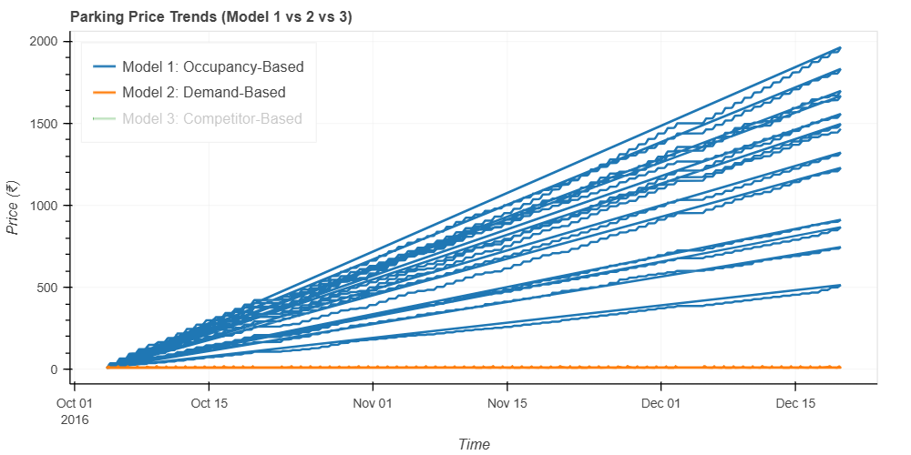

# 🚗 Dynamic Pricing for Urban Parking Lots

An intelligent, real-time pricing engine for urban parking spaces using real-time traffic, vehicle, and demand data. This project leverages simulation, machine learning, and competitive pricing logic to dynamically update parking prices with fairness and efficiency.

---

## 📚 Table of Contents

- [📓 Colab Notebook](#-colab-notebook)
- [📊 Models Implemented](#-models-implemented)
- [📈 Demand Function](#-demand-function)
- [📎 Assumptions](#-assumptions)
- [📉 Pricing Dynamics](#-pricing-dynamics)
- [📦 Dataset](#-dataset)
- [🛠️ Tech Stack](#️-tech-stack)
- [📌 Setup & Execution](#-setup--execution)
- [🔍 Visualizations](#-visualizations)

---

## 🧾 Colab Notebook

A modular and well-documented [Google Colab notebook](link-to-your-notebook) is included.

> ✅ All code cells include clear comments explaining the logic, model assumptions, and visualization steps.

### Structure:
1. Data loading & preprocessing  
2. Feature engineering  
3. Real-time simulation (Pathway)  
4. Pricing model implementation  
5. Bokeh-based interactive visualizations  
6. Model comparison and evaluation  

---

## 📊 Models Implemented

| Model | Name             | Basis                        | Formula Summary                                       |
|-------|------------------|------------------------------|-------------------------------------------------------|
| 1     | **Occupancy-Based**  | Parking capacity utilization | `Price = Base + α × (Occupancy / Capacity)`           |
| 2     | **Demand-Based**     | Real-time features + ML      | `Price = f(Occupancy, VehicleType, QueueLength, ...)` |
| 3     | **Competitor-Based** | Competitive pricing strategy | `Price = Avg(Model1, Model2) × Competitor Adjustment` |

---

## 📈 Demand Function

We treat price as a **non-linear function** of key real-time features:

### 🔧 Variables Considered:
- `Occupancy`
- `VehicleType` (car, bike, truck, etc.)
- `QueueLength`
- `TrafficConditionNearby` (low / average / high)
- `IsSpecialDay`

### 📐 Model 2 (Demand-Based ML Pricing)
```math
Price = f(Occupancy, QueueLength, VehicleType, TrafficCondition, IsSpecialDay)
```

## 📎 Assumptions
Price Elasticity: Higher demand → Higher tolerance for increased prices.

Vehicle-Type Weightage: Trucks/cars priced higher than bikes/cycles.

No Prior Reservations: All decisions are made in real time.

Uniform Zonal Pricing: No geographical pricing bias.

## 📉 Pricing Dynamics

### 🟦 Model 1: Occupancy-Based
Linear growth with utilization

Simple, transparent

Lacks responsiveness to real-world context

### 🟧 Model 2: Demand-Based ML
Multi-variable pricing logic

Adapts to context and external conditions

Suitable for dense urban environments

### 🟩 Model 3: Competitor-Aware
Weighted average of Models 1 & 2

Adds commercial realism with simulated competition

Ideal for areas with multiple parking providers

### 📦 Dataset
Main Dataset: Real-time vehicle entry logs, traffic levels, special day indicators, etc.

Simulated Features: Competitor pricing, queue length, traffic conditions

Time Span: Hour-wise parking data for a central urban zone

## 🛠️ Tech Stack
Python, Pandas, NumPy

Pathway: For real-time data simulation

XGBoost / Random Forest: ML models for dynamic pricing

Bokeh: Interactive graphs and visualizations

Colab / Jupyter: Development environment

### 🛠️ Architecture Diagram



## 📌 Setup & Execution
⚙️ Clone the Repo
bash
Copy
Edit
git clone https://github.com/your-username/urban-parking-dynamic-pricing.git
cd urban-parking-dynamic-pricing
▶️ Run the Notebook
Open Dynamic_Pricing_Notebook.ipynb in Google Colab or Jupyter.

Ensure the required libraries are installed:

bash
Copy
Edit
pip install pandas numpy bokeh xgboost pathway

## 🔍 Visualizations

Bokeh is used to generate interactive charts for:

- Pricing trends across time
- Occupancy levels vs price
- Cross-model price comparisons
- Real-time demand fluctuations

### 📷 Sample Visualization


